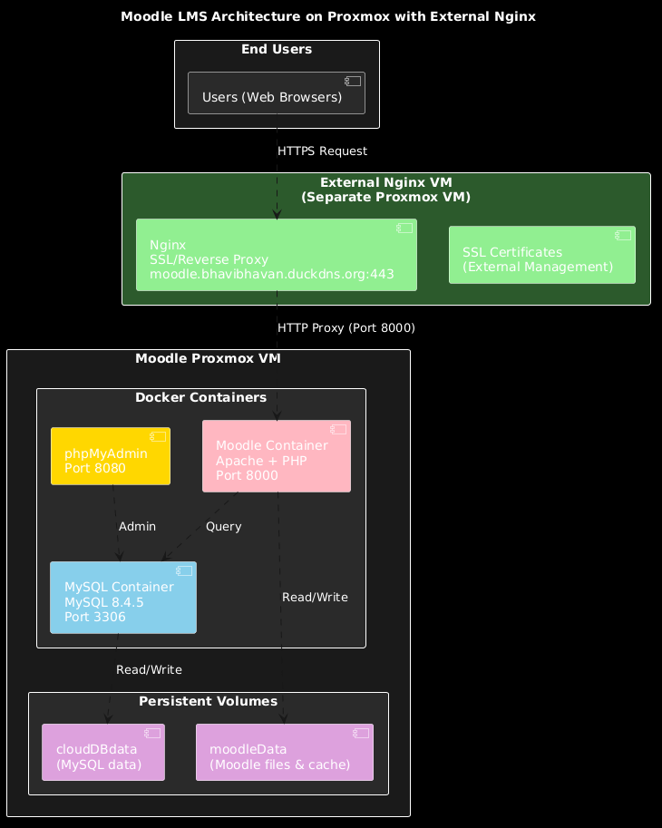

# Moodle LMS on Proxmox with Docker Compose

[](https://www.docker.com/)
[](https://moodle.org/)
[](https://www.mysql.com/)
[](https://www.proxmox.com/)

This project deploys a **Moodle Learning Management System (LMS)** on a **Proxmox VM** using Docker Compose. It was designed to support an online exam setup for **200–500 concurrent users**.

The deployment includes a custom Moodle Docker image (built from the [Moodle Git repository](https://docs.moodle.org/500/en/Git_for_Administrators)), MySQL database, and phpMyAdmin for database management. **SSL termination and reverse proxying are handled by an external Nginx instance** on a separate Proxmox VM.

## 🚀 Project Overview

* **Moodle Service**: Custom Docker image (`satty008/runmoodle:1.7`) with an `entrypoint.sh` script that dynamically generates `config.php` using environment variables and secret files.
* **Database**: MySQL 8.4.5 with persistent storage via Docker named volumes.
* **phpMyAdmin**: Database management tool to interact with Moodle's MySQL database (port 8080).
* **External Nginx & SSL**: Reverse proxy and SSL termination are handled on a separate Proxmox VM (not included in this compose stack).

This architecture ensures a **secure, scalable, and production-ready Moodle LMS** deployment.

## 🏗️ Architecture

The architecture of the deployment is documented in the [`architecture`](./architecture/) folder

<p align="center">
  
</p>

## 📦 Services

### 1. Moodle Service

* Custom Docker image (`satty008/runmoodle:1.7`).
* Runs Apache + PHP with Moodle codebase.
* Exposes port **8000** for access from external Nginx reverse proxy.
* Uses **entrypoint.sh** to auto-generate `config.php` at container startup.
* Persists uploaded files and cache in `moodleData` volume.

### 2. MySQL Database

* MySQL 8.4.5 container.
* Stores Moodle database.
* Persists data in `cloudDBdata` volume.
* Reads root and user passwords from secret files in `./secrets/`.

### 3. phpMyAdmin

* Runs on port **8080**.
* Allows DB administrators to log in with MySQL credentials.
* Depends on `moodleDB` to be available.

### 4. External Nginx & SSL (Not in this compose stack)

* Runs on a **separate Proxmox VM**.
* Acts as reverse proxy and SSL terminator.
* Forwards traffic to Moodle service on `<moodle-vm-ip>:8000`.
* Handles ports **80** and **443** for your domain (`moodle.bhavibhavan.duckdns.org`).
* SSL certificates managed externally (not via Certbot).

## 🔑 Secrets Management

Instead of Docker secrets, this setup uses **plain text secret files** stored locally inside a `secrets/` folder:

```bash
mkdir secrets
echo "secure_root_password" > secrets/db_root_password.txt
echo "secure_db_password" > secrets/db_password.txt
```

In `compose.yml`, these files are mounted and read by MySQL and Moodle containers.

## ⚙️ Deployment

### Prerequisites

* **Proxmox VM** running Ubuntu 24 LTS (or similar).
* Network connectivity between Moodle VM and external Nginx VM.
* External Nginx instance running on a separate Proxmox VM (with SSL certificates configured).
* Domain name (e.g., `moodle.bhavibhavan.duckdns.org`) pointing to your external Nginx instance.
* Docker & Docker Compose installed (or use the `proxmox-setup.sh` script).

### Steps

1. **Clone Repository**

   ```bash
   git clone https://github.com/satty008/moodle-docker-compose.git
   cd moodle-docker-compose
   ```

2. **(Optional) Run Setup Script**
   
   If Docker is not installed, run the Proxmox setup script:

   ```bash
   chmod +x proxmox-setup.sh
   ./proxmox-setup.sh
   ```

3. **Prepare Environment Variables**
   
   The `.env` file is pre-configured:

   ```bash
   MYSQL_DATABASE=moodledatabase
   MYSQL_USER=moodleuser
   MYSQL_HOST=moodleDB
   MYSQL_PORT=3306
   ```

4. **Create Secret Files**

   ```bash
   mkdir secrets
   echo "your_secure_root_password" > secrets/db_root_password.txt
   echo "your_secure_db_password" > secrets/db_password.txt
   ```

5. **Build Custom Docker Image**

   ```bash
   docker build -t satty008/runmoodle:1.7 .
   ```

   (Or push to DockerHub if deploying across multiple machines)

6. **Start Services**

   ```bash
   docker compose up -d
   ```

7. **Configure External Nginx Reverse Proxy**

   On your external Nginx VM, add a reverse proxy configuration to forward traffic:

   ```nginx
   server {
       listen 443 ssl http2;
       server_name moodle.bhavibhavan.duckdns.org;
       
       ssl_certificate /path/to/your/ssl/cert.pem;
       ssl_certificate_key /path/to/your/ssl/key.pem;
       
       location / {
           proxy_pass http://<moodle-vm-ip>:8000;
           proxy_set_header Host $host;
           proxy_set_header X-Real-IP $remote_addr;
           proxy_set_header X-Forwarded-For $proxy_add_x_forwarded_for;
           proxy_set_header X-Forwarded-Proto https;
       }
   }

   server {
       listen 80;
       server_name moodle.bhavibhavan.duckdns.org;
       return 301 https://$server_name$request_uri;
   }
   ```

8. **Access Services**

   * **Moodle LMS** → `https://moodle.bhavibhavan.duckdns.org` (via external Nginx)
   * **phpMyAdmin** → `http://<moodle-vm-ip>:8080` (direct access from your network)
   * **Database** → MySQL on port 3306 (internal to containers, accessible via phpMyAdmin)

## 📝 Understanding `entrypoint.sh`

The `entrypoint.sh` script is responsible for **configuring Moodle automatically** when the container starts. Let's break it down step by step:

```bash
#!/bin/bash
set -e
```

* Uses **bash shell**.
* `set -e` → stop immediately if any command fails.

```bash
MOODLE_DIR=/var/www/html
MOODLE_CONFIG=$MOODLE_DIR/config.php
MOODLE_DATA=/var/www/moodledata
```

* Defines paths for Moodle code, config file, and data directory.

```bash
if [ ! -f "$MOODLE_CONFIG" ]; then
  echo "Generating Moodle config.php..."
  DB_PASS="$(cat "$MOODLE_DATABASE_PASSWORD_FILE")"
```

* Checks if `config.php` already exists.
* If not, it **creates one**.
* Reads DB password securely from a file (`/run/secrets/...` or mounted file).

```php
  cat > "$MOODLE_CONFIG" <<EOF
<?php
unset(\$CFG);
global \$CFG;
\$CFG = new stdClass();
...
EOF
```

* Writes a fresh **Moodle config.php** with PHP settings.
* Sets database connection, site URL (`wwwroot`), and data directory.

```php
\$CFG->sslproxy  = true;
```

* Tells Moodle it's running behind an SSL-terminating proxy (Nginx).

```bash
else
  echo "Moodle config.php already exists — skipping generation."
fi
```

* If config already exists → skip regeneration (avoids overwriting).

```bash
exec apache2-foreground
```

* Finally, starts the Apache web server in the foreground → keeps the container alive.

👉 In simple terms:
**"On first run, generate Moodle's config file from environment variables and secrets, then start Apache. On later runs, skip config generation and just start Apache."**
